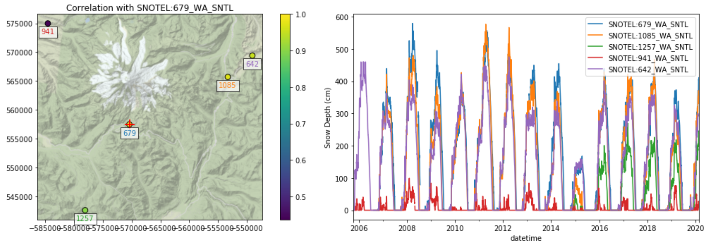
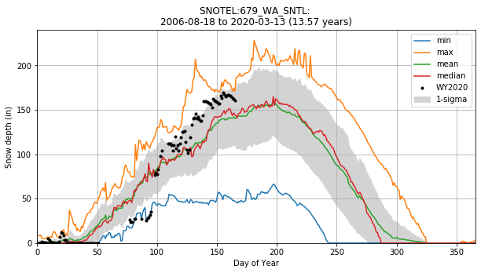
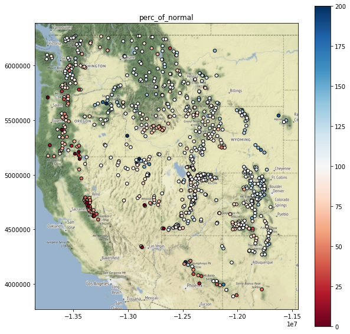

# Geospatial Data Analysis with Python
Course material from the Winter 2020 offering at the University of Washington  

David Shean  
Civil and Environmental Engineering  
University of Washington  
https://dshean.github.io

## Overview
This course explores geospatial data processing, analysis, interpretation, and visualization techniques using Python and open-source tools/libraries (GDAL, NumPy, Pandas foundation and geospatial options like rasterio, GeoPandas and xarray). We will explore fundamental concepts and real-world data science applications involving a variety of large geospatial datasets.

#### Highlights:  
- Aspects of both data engineering and data science, with exploratory data analysis approach
- Learn how to programatically answer real-world remote sensing and GIS questions (and how to ask the right questions)
- Query and process geospatial data on-the-fly, without manual downloads
- Limited emphasis on machine learning, but some examples scattered throughout labs (e.g., K-means clustering in week 03 lab)
- Examples focus on Washington state and Western U.S.

## Sample visualizations
#### ICESat satellite laser altimetry point data near Western U.S. glaciers

#### Raster DEM analysis near Washington state highways

#### Landsat-8 multi-spectral satellite imagery for Mt. Rainier to determine snow-covered area

#### Western U.S. SNOTEL network vector time series

#### Raster time series analysis using global and regional climate reanalysis data

## Modules
1. [Shell and git/Github](modules/01_Shell_Github)
1. [Python, iPython, Jupyter notebooks](modules/02_Python_Jupyter)
1. [Numpy, Pandas, Matplotlib](modules/03_NumPy_Pandas_Matplotlib)
1. Vector 1: Geopandas, CRS, Projections
1. [Raster 1: GDAL, rasterio, Landsat-8 satellite imagery](modules/05_Raster1_GDAL_rasterio_LS8)
1. Vector 2: Geometries, Spatial Operations, Visualization
1. Raster 2: Warping, Clipping, Sampling, DEM Analysis
1. Vector time series, SNOTEL data
1. nD Array, xarray, ERA5 Climate reanalysis
1. [Pangeo, Dask, conda](modules/10_Conda_Pangeo_Dask)

## Syllabus
https://docs.google.com/document/d/17HRRH7rgbAR3-BnJP9qKdAheam8_qngzyuNO45FWjxQ/edit?usp=sharing

## Structure
Mixed graduate and upper-level undergraduate course:
* Weekly workflow
    * Students independently complete online reading assignments or work through tutorials prior to lab
    * One in-person (or virtual) 3-hour lab session on Friday afternoon
      * Lab starts with 0.5-1.5 hour introduction, review, and interactive discussion/demo using Jupyter notebook, terminal, and/or Github
      * Students work in small groups to attempt exercises in a Jupyter notebook in small groups
      * Students finish exercises (and "extra credit" challenge problems) for homework (due the following week)
    * Students report ~6-12 hours outside of the 3-hour lab required to complete reading and homework
    * See weekly workflow document in instructor and student [resources](resources) for technical details
* [Final Project](project/README.md)
   * Students propose, refine, perform and present independent or group projects
   * Final deliverables: Github repository and ~10 minute presentation

### [Resources for students](resources/students)
* Most current resources are intended for students enrolled in the class at the University of Washington
* I am planning to prepare additional resources for students attempting independent self-study, or those who are attempting individual modules rather than the full 10-week course (see syllabus for additional thoughts on philosophy and time commitment). The reality is that the exercises each week build on skills developed in previous weeks.

### [Resources for instructors](resources/instructors)
* I've started compiling resources, notes and recommendations for others who are or will be teaching similar material (or using similar approaches).
* If you find this content useful, please consider contributing corrections, modifications or suggestions. Or, at the very least, "star" the repository by clicking the button in upper right corner of the repo landing page.

### Solutions
* The notebooks in this public repo are the "student" versions, with many empty cells and instructions for lab exercises. The completed notebooks with my solutions are archived in a private [solutions repo](https://github.com/UW-GDA/gda_w2020_solutions). Enrolled students receive access to this repo after submitting their own solutions to the lab exercises each week. I have not released the solutions publicly, as I expect future students enrolled in the course to learn "the hard way" as they work through the problems on their own. If you have independently tried to work through these notebooks and would like to compare your answers, I can potentially add you as a collaborator.
* I wish that I had a better approach for distribution, as I know that these solutions to be a useful resource for those who can't dedicate weeks to learn the material. My priority right now is to preserve the learning experience for enrolled students, and to be able to reuse similar material in the coming years (developing these notebooks requires a considerable amount of time). I am open to suggestions on strategies that will enable students to "unlock" the solutions as they incrementally make progress.

## Reproducing the GDA Course environment
  
Clicking this badge will launch the GDA image and Jupyterlab environment on [mybinder.org](https://mybinder.org). This will provide the same environment that was available on the course Jupyterhub during winter 2020. 

You can use the file browser on the left side to navigate and launch interactive notebooks in the `gda_2020/modules` directory.  Try it!

*Note: the hardware resources are limited (only 2 GB of RAM) and the session is ephemeral. Your home directory will not persist, so use this only for exploration and demos. You can always right-click on a file and download locally if you want to preserve your changes, or use git/github!*

### Reproducing locally
See the [Week 10 materials](./modules/10_Conda_Pangeo_Dask) for instructions.
Conda environment files:
* [uwgda2020](https://github.com/UW-GDA/uwgda-image/blob/master/binder/environment.yml) (pinned version numbers)
* [uwgda2020_latest](https://github.com/UW-GDA/uwgda-image/blob/master/binder/environment_latest.yml) (includes latest features/bugfixes, untested with course material)

## Contributions
If you find errors or make some improvements, please consider creating a Github Issue or submitting a Pull Request. I view this as an open, collaborative effort. I expect to teach this course in the coming years, and will continue refining the material, so I appreciate all of the help I can get.

## Acknowledgements
Many individuals have contributed to the content development and infrastructure required for this course:
* First and foremost, the brave GDA students who enrolled in this course duing winter 2019 and winter 2020 provided critical feedback, suggestions and often elegant solutions to challenging problems
* Chris Land (UW-IT) and Scott Henderson (UW eScience/ESS) provided Jupyterhub configuration and support during 2020
* Amanda Tan (UW eScience) provided Jupyterhub configuration and support during 2019
* Bill Schaefer (UW-IT) and Rob Fatland (UW-IT/eScience) provided spport and management during 2020 and 2019, respectively
* Friedrich Knuth provided material on conda and support
* Anthony Arendt and the UW eScience Geohackweek leadership team for providing a foundation and resources for interactive education and software development

## Citation
[Insert Zenodo DOI]

## License
 
The content of this repository is licensed under a <a rel="license" href="http://creativecommons.org/licenses/by-sa/4.0/">Creative Commons Attribution-ShareAlike 4.0 International License</a>, and the embedded source code is licensed under the [MIT license](https://opensource.org/licenses/MIT).
